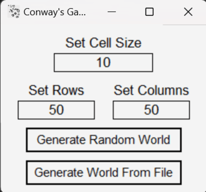
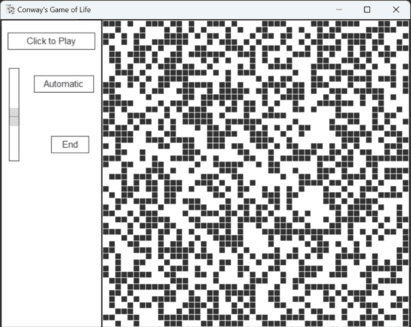
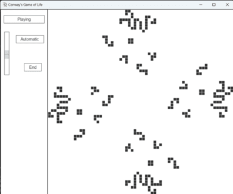
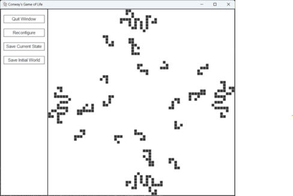

# Conway's Game of Life

A recreation of Conway's Game of Life, allowing the user to run a customizable simulation.

## Description

Conway's Game of Life is a game invented by John Conway as a demonstration of the growth and decay of colonies. While it is considered a game, there is little user input necessary after the world has been created, as the colony changes by itself with each generation. The game starts in an initial world with an array of cells which are either alive or dead. 
The generation following after will be determined based on a set of rules:
1. A location that has zero or one neighbors will be empty in the next. If a cell was in that location, it dies of loneliness.
2. A location with two neighbors is stable—that is, if it contained a cell, it still contains a cell. If it was empty, it's still empty.
3. A location with three neighbors will contain a cell in the next generation. If it was unoccupied before, a new cell is If it currently contains a cell, the cell remains. Good times.
4. A location with four or more neighbors will be empty in the next If there was a cell in that location, it dies of overcrowding.
From this generation the next generation will be created, and thus the cycle continues.

## Getting Started

### Relevant Modules

* ```./program.py```: This module calls an instance of the Config class
* ```./config.py```: This module holds the Config class which creates a window which allows customization of the world, then creating an instance of the Simulator class
* ```./simulator.py```: This module holds the Simulator class which creates a window with the simulation along with a control panel on one side.
* ```./datastructures/array2d.py```: This module holds the Array2D class which is used as the internal data structure of the simulation board. While this class uses the Array data structure described below, it is functionally akin to a two dimensional python list.
* ```./datastructures/array.py```: This module holds the Array class which is the internal data structure of the Array2D class. While this class uses a numpy array as its internal data structure, it is functionally akin to a python list.

### Dependencies

* Python 3.11.3 (recommended version)
* Tkinter for Python

### Installing and Executing

* Clone this repository to get this program.
* Navigate to the repository using command prompt or a code editor.
* Run ```python -m program.py```

## Playing the Game

When the program is executed, a window will pop up prompting the user to either generate a random world or generate a preset world (3 presets can be found in the ```/world``` folder). If the user is generating a random world, they have the options to set the size of each cell (measured in pixels), the row size and the column size. The config window is shown below.
<br>



<br>

Once the world has been configured, the config will close and a simulation window will pop up. Here the user can see a grid with their starting world. There will be several controls on the left hand side:
* A button to cycle between automatic mode, where the generations progress by themselves, and manual mode, where the user controls the progression.
* A multi-purpose button to pause and play in the case of automatic mode or move to the next generation in the case of manual mode.
* A speed slider to control how fast the generations progress.
* A button that ends the simulation.
<br>
Below are two potential starting worlds, one being a randomized world and the other being a preset.
<br>




<br>

If the user ends the game or the board becomes still (where no cells are coming to life or dying), the game will no longer progress through generations of cells and the control buttons will clear out as options for where to take the user next replace them. These options are as follows:
* An option to quit the game.
* An option to take the user back to the config window.
* An option to save the current world state as a file.
* An option to save the initial world state as a file.
<br>
This screen is shown below.
<br>



<br>

## About File Loading

The configuration window takes a ```.txt``` file in the format:
```
size:[cell size]
rows:[row number]
cols:[col number]
[each row of the board is a line here. Live cells in the row are marked by "X" while dead cells are marked by "-"]
```
If the filepath cannot be found or the file fails to load properly, an error message will be displayed to the user.

## Drawbacks of this simulation

This program represents all of what is essential to a typical simulator of Conway's Game of Life. However, there are several drawbacks which may limit the user's experience:
1. Speed: Because this program is written in Python, it loses some of the efficiency that C or C++ might give which would allow for faster progression or larger worlds.
2. Finite world: Because the simulation board is based in a simple two dimensional array data structure, the user cannot go beyond the borders of the world. To make this possible, a board can be implemented that only keeps track of live cells. Not only would this be a much more efficient structure, it would allow the user to explore infinitely, displaying the appropriate live cells when needed.
3. Inalterable world: The feature to, as the user, change which cells are active has not been implemented in this program. This would not be incredibly challenging to add, either to the current program or a program supporting infinite exploration as mentioned above.
4. Inneficient read-in files: For these purposes, there is a neglible amount of extra space / time involved in dealing with preset worlds. However, if this project were to take on larger worlds, it may be beneficial to make the preset file structure more efficient. One way to do this is to keep the three lines of metadata at the top (cell size, row number and column number) and make each live cell a pair of coordinates. This would eliminate the potentially large amount of dead cell space in the file.

## Author

Erik Griswold